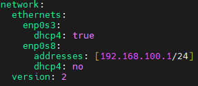
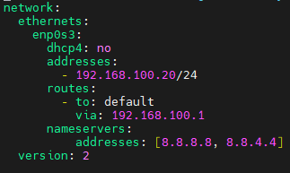
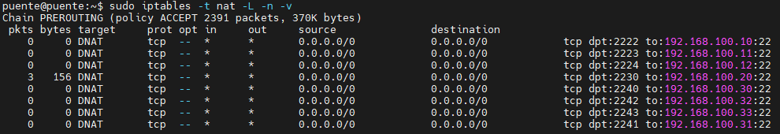

# Creación Clúster Kubernetes Usando Kubeadm

## Contenidos

- [Herramientas Disponibles](#herramientas-disponibles)
- [Creación de la Infraestructura](#creación-de-la-infraestructura)
- [Elección e Instalación de un CRI (Container Runtime Interface)]()
- [Instalación y Configuración de Kubeadm]()
- [Elección e Instalación del PodNetwork]()
- [Elección e Instalación de un Orquestador de Almacenamiento]()

## Herramientas disponibles

Existen varias herramientas que facilitan la creación de un clúster on-premise de kubernetes, las más usadas son las siguientes:

- [MicroK8s](https://microk8s.io): Desarrollado por Canonical, de describen a sí mismos como la forma más rápida y sencilla de desplegar un clúster de kubernetes, tanto para experimentación como para despliegues de producción. Se instala fácilmente como un snap y ofrece actualizaciones aumáticas de forma segura sin que el administrador se tenga que preocupar por incompatibilidades. Tiene varias opciones a la hora de instalarlo para habilitar los servicios del cluster deseados.

- [K3s](https://k3s.io): Similar a MicroK8s, originalmente diseñado por RANCHER y actualmente bajo gestión del Cloud Native Computing Foundation, ofrece una solución rápida y ligera para el despliegue de un clúster. K3s mantiene la mayoría de características de Kubernetes pero elimina los drivers y componentes menos usados del mismo. Se ejecuta como un solor archivo binario, reduciendo sustancialmente los recursos necesarios para su funcionamiento, lo cual lo convierte en una opción ideal para aquellos que busquen una alternativa sencilla para despliegues de producción poco exigentes y que no requiera de una infraestructura compleja. 

- [Kubeadm](https://kubernetes.io/docs/reference/setup-tools/kubeadm/): La alternativa "Oficial", creado y mantenido por el propio proyecto de Kubernetes. Su objetivo es proveer una forma estándar y correcta de crear clústers válidos para producción, permite el despliegue y configuración de todos los servicios de Kubernetes pero ofreciendo una capa de abstracción que simplifica la configuración de los mismos, dentro de las herramientas existentes, es la más cercana a un despliegue "manual" de un cluster de Kubernetes.

Si bien MicroK8s y K3s son excelentes opciones altamente usadas, he elegido usar Kubeadm ya que es la que ofrece mayor flexibilidad y la que más se aproxima a un despliegue totalmente manual, si bien esto último es algo cada vez menos realizado en comparación con los despliegues empleando estas herramientas.

## Creación de la infraestructura

Kubernetes distingue entre 2 tipos de nodos, los control plane y los worker:

-  Control Plane: Responsable de la gestión global del cluster de Kubernetes, ejecutan los servicios críticos para el funcionamiento del mismo:
    - Kube-apiserver: Actúa como puerta de entrada al Control Plane, permitiendo la configuración del cluster a través de herramientas CLI, bibliotecas de terceros o directamente a través de solicitudes HTTP.
    - etcd: Una base de datos clave-valor consistente y de alta disponibilidad que almacena toda la información relativa a la configuración del cluster, también es usado por los demás elementos del Control Plane para preservar el estado actual del cluster. 
    - kube-sheduler: Se encarga de encontrar pods recién creados y de asignarles un nodo en el que ejecutarse teniendo en cuenta los requisitos de recursos, políticas de afinidad, restricciones y otras especificaciones.
    - kube-controller-manager: El componente encargado de ejecutar los procesos de control, si bien cada uno de ellos tiene una lógica distinta, han sido unidos en un solo binarizado para ejecutarse en un único proceso con el fin de reducir complejidad y aumentar la eficiencia.
    - cloud-controller-manager:  Este componente es opcional, alberga toda la lógica dedicada a la vinculación del cluster con la API de proveedores de cloud computing, permitiendo la interacción de forma efectiva entre Kubernetes y la infraestructura de nube elegida.

    Por defecto, los pods de despliegues no se ejecutan en los control plane.

- Nodos Worker: Son los encargados de ejecutar los pods de los despliegues. 

El clúster estará compuesto por cinco máquinas virtuales [Ubuntu Server 22.04](https://ubuntu.com/download/server), una imagen de ubuntu ligera, ideal para este tipo de despliegues. En este caso, se dedicará una mv para ejercer de puente entre la red externa y la red interna, otra para que haga de control plane y las otras tres para hacer de nodos worker. 

La mejor opción sería que estuviesen funcionando con algún software de virtualización similar a [VMware](https://www.vmware.com), pero he preferido usar [VirtualBox](https://www.virtualbox.org) ya que no se va a tratar de un despliegue de producción real y la eficiencia no es la prioridad, al menos en este punto. 

Lo único relevante de la configuración de las mv para este documento es la configuración de las interfaces de red, en el caso de la máquina puente, se modificará el fichero de netplan de esta forma:

<figure align="center">
  
  <figcaption><strong>Fichero Configuración Netplan Puente</strong></figcaption>
</figure>

Como se puede ver, la red interna será la 192.168.100.0/24, en ella estarán todos los nodos del clúster. Para que puedan acceder a internet, tendrán que hacerlo a través de la máquina puente. Para ello, habrá que editar el fichero /etc/sysctl.conf y modificar el campo net.ipv4.ip_forward de 0 a 1.  
Para que el cambio haga efecto, se puede ejecutar un:

```
sudo sysctl -p
```

Un fichero de ejemplo del netplan de cada nodo sería el siguiente:

<figure align="center">
  
  <figcaption><strong>Fichero Configuración Netplan CP1</strong></figcaption>
</figure>

Las direcciones IP del cluster están fijas y corresponen a las siguientes:
 - cp1 - 192.168.100.20/24
 - k8sworker1 - 192.168.100.31/24
 - k8sworker2 - 192.168.100.32/24
 - k8sworker3 - 192.168.100.33/24

Para poder acceder a ellos desde ssh de una forma cómoda, he usado [Mobaxterm](https://mobaxterm.mobatek.net) y configurado la máquina puente con un nat de  iptables para que redirija las solicitudes ssh que reciba desde el exterior a las mv correspondientes:

```
sudo iptables -t nat -A PREROUTING -p tcp --dport 2230 -j DNAT --to-destination 192.168.100.30:22
```

<figure align="center">
  
  <figcaption><strong>Fichero Configuración Netplan CP1</strong></figcaption>
</figure>